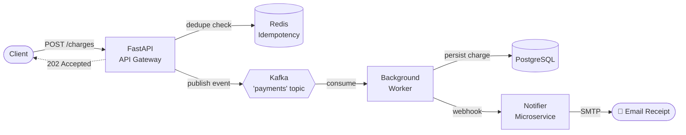
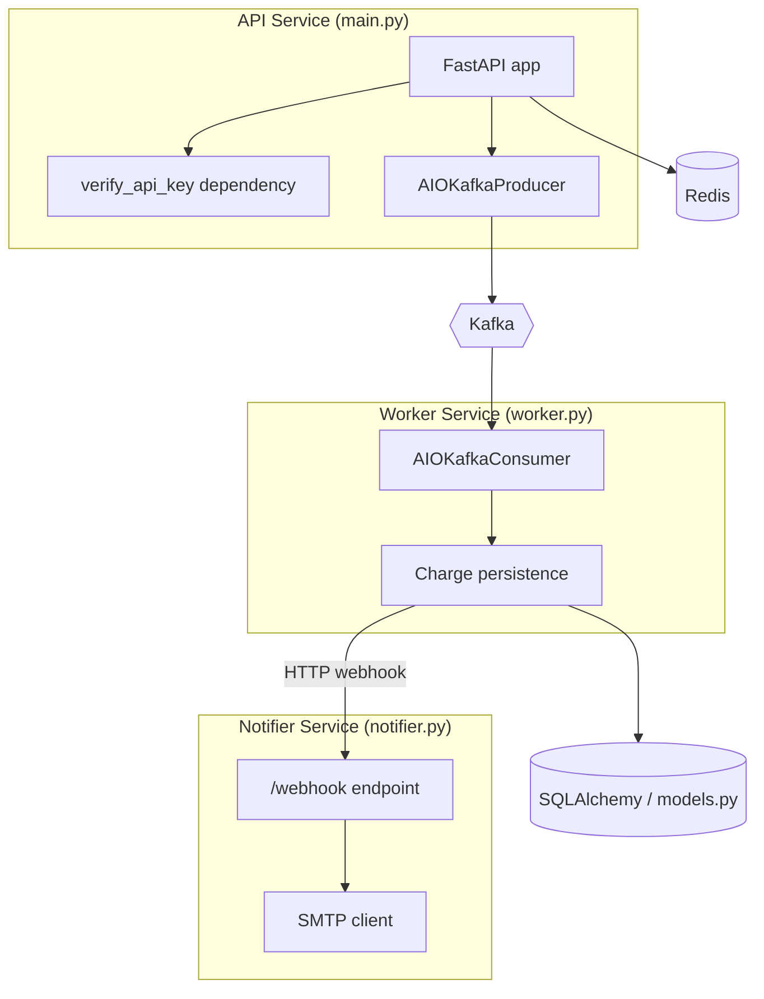
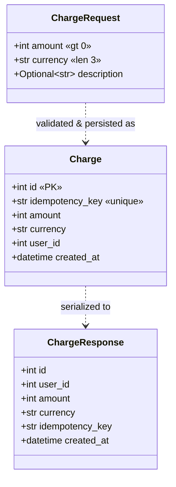
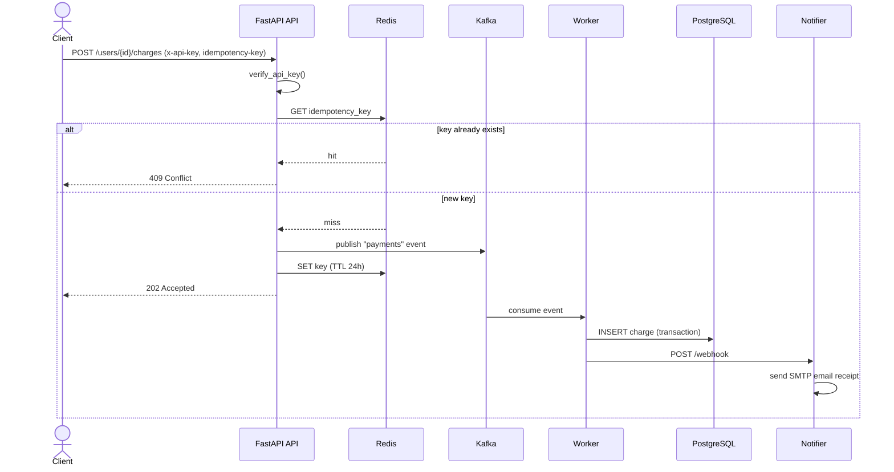

# 🚀 Mock Payment Gateway API

An **event-driven, asynchronous payment processing system** built with Python and FastAPI — designed to mirror the architecture real payment processors (Stripe, Adyen) use to handle money reliably at scale.

This isn't a CRUD app. It demonstrates the patterns that matter when correctness is non-negotiable: **idempotency**, **decoupled async processing via a message broker**, **at-least-once delivery with a background worker**, and **service-to-service webhooks** — all containerized and covered by CI.

[](https://github.com/sravanib04/mock-payment-gateway-api/actions/workflows/tests.yml)


---

## 🧠 Why This Project Is Interesting

Payment APIs have a hard requirement: **a single click must never charge a customer twice**, even if the network retries, the client double-submits, or a service crashes mid-request. Naively writing to a database doesn't solve this.

This system solves it with a layered design:

1. **Accept fast, process later.** The API validates the request, deduplicates it, drops it onto a Kafka topic, and instantly returns `202 Accepted`. The user never waits on the database.
2. **Deduplicate at the edge.** Redis holds every `Idempotency-Key` for 24h, so duplicate requests are rejected in microseconds with `409 Conflict` — before any work happens.
3. **Process durably.** A dedicated background worker consumes the Kafka topic, writes the charge to PostgreSQL in a transaction, and only then fires a webhook to the notification service.
4. **Notify out-of-band.** A separate microservice receives the webhook and sends a real email receipt over SMTP.

This is the same **CQRS-flavored, write-behind** pattern used in high-throughput financial systems: the write path is cheap and fast, the heavy lifting is async and horizontally scalable.

---

## 🏗️ System Architecture



**Request lifecycle:**

```
1. Client POSTs a charge with an Idempotency-Key
2. API checks Redis      → key seen before? → 409 Conflict
3. API publishes event   → Kafka 'payments' topic
4. API stores key in Redis (TTL 24h) and returns 202 Accepted
5. Worker consumes event → writes Charge row to PostgreSQL
6. Worker fires webhook  → Notifier service
7. Notifier sends email  → SMTP receipt
```

---

## 📐 UML Diagrams

### Component Diagram



### Class Diagram (Domain Model)



### Sequence Diagram (Charge Flow)



---

## 🛠️ Tech Stack

| Layer | Technology | Why |
|-------|-----------|-----|
| **API Framework** | FastAPI (Python 3.12) | Async, type-safe, auto-generated OpenAPI docs |
| **Message Broker** | Apache Kafka (aiokafka) | Decouples ingestion from processing; durable, replayable event log |
| **Cache / Dedup** | Redis | Sub-millisecond idempotency lookups with TTL |
| **Database** | PostgreSQL + asyncpg | Durable transactional storage of charges |
| **ORM** | SQLAlchemy 2.0 (async) | Modern async ORM patterns |
| **Validation** | Pydantic v2 | Strict request/response schemas |
| **Containerization** | Docker & Docker Compose | One-command, reproducible multi-service stack |
| **CI** | GitHub Actions | Automated integration tests on every push/PR |
| **Notifications** | SMTP microservice | Out-of-band, service-to-service webhooks |

---

## ✨ Core Features

- **⚡ Async, non-blocking I/O** end-to-end — high throughput under load.
- **🔁 Idempotency protection** via Redis — duplicate `Idempotency-Key`s return `409 Conflict` instantly, never double-charging.
- **📨 Event-driven processing** — Kafka decouples the API from the database so the write path stays fast and the worker scales independently.
- **👷 Durable background worker** — consumes events, persists charges transactionally with rollback on failure.
- **🔔 Service-to-service webhooks** — a standalone notifier microservice sends email receipts.
- **🔐 API-key authentication** enforced via FastAPI dependency injection.
- **✅ Strict validation** — all payloads validated against Pydantic schemas.
- **🧪 Automated CI** — async integration tests run on every push and pull request.
- **🔑 12-factor config** — all secrets and endpoints externalized to environment variables, never hardcoded.

---

## 📦 Quickstart (One Command)

No local Python or Postgres needed — just Docker.

### 1. Clone and configure

```bash
git clone https://github.com/sravanib04/mock-payment-gateway-api.git
cd mock-payment-gateway-api
cp .env.example .env   # then fill in your values
```

### 2. Launch the full stack

```bash
docker compose up --build
```

This spins up **six services**: API, PostgreSQL, Redis, Kafka, the background worker, and the notifier.

| Service | URL / Port |
|---------|-----------|
| API | http://localhost:8000 |
| Swagger UI | http://localhost:8000/docs |
| Notifier | http://localhost:8001 |
| PostgreSQL | `localhost:5433` |
| Redis | `localhost:6379` |
| Kafka | `localhost:9092` |

---

## 💻 Usage Example

```bash
curl -X POST http://localhost:8000/users/999/charges \
  -H "x-api-key: $API_KEY_SECRET" \
  -H "idempotency-key: order-abc-123" \
  -H "Content-Type: application/json" \
  -d '{"amount": 50, "currency": "USD", "description": "Test Charge"}'
```

**First request → `202 Accepted`:**

```json
{
  "status": "processing",
  "message": "Payment dropped on the conveyor belt!",
  "idempotency_key": "order-abc-123"
}
```

**Duplicate request (same key) → `409 Conflict`:**

```json
{
  "detail": "Idempotency Key 'order-abc-123' has already been used. (Caught by Redis!)"
}
```

**Retrieve a user's charges → `200 OK`:**

```bash
curl http://localhost:8000/users/999/charges -H "x-api-key: $API_KEY_SECRET"
```

---

## 📡 API Reference

| Method | Endpoint | Auth | Success | Description |
|--------|----------|------|---------|-------------|
| `POST` | `/users/{user_id}/charges` | `x-api-key` | `202 Accepted` | Submit a charge for async processing |
| `GET`  | `/users/{user_id}/charges` | `x-api-key` | `200 OK` | List all charges for a user |

### Required Headers

| Header | Required on | Description |
|--------|-------------|-------------|
| `x-api-key` | all endpoints | API authentication key |
| `idempotency-key` | `POST` | Unique key preventing duplicate charges |
| `Content-Type` | `POST` | Must be `application/json` |

### Request Body

```json
{
  "amount": 50,
  "currency": "USD",
  "description": "Test Charge"
}
```

---

## ⚙️ Configuration

All configuration lives in environment variables (see [`.env.example`](.env.example)). Nothing sensitive is committed to source.

| Variable | Description |
|----------|-------------|
| `API_KEY_SECRET` | API authentication key |
| `POSTGRES_USER` / `POSTGRES_PASSWORD` / `POSTGRES_DB` | Database credentials |
| `DATABASE_URL_LOCAL` | Connection string for host runs (the Docker URL is built from the `POSTGRES_*` vars) |
| `REDIS_URL` | Redis connection URL |
| `KAFKA_URL` | Kafka broker address |
| `NOTIFIER_URL` | Worker → notifier webhook URL |
| `SENDER_EMAIL` / `RECEIVER_EMAIL` / `APP_PASSWORD` | SMTP credentials for email receipts |
| `AWS_*` | LocalStack/Floci endpoint + dummy credentials |

> **CI note:** GitHub Actions reads `API_KEY_SECRET`, `POSTGRES_USER`, `POSTGRES_PASSWORD`, and `POSTGRES_DB` from repository secrets.

---

## 🧪 Running Tests

```bash
python -m venv .venv && source .venv/bin/activate   # Windows: .venv\Scripts\activate
pip install -r requirements.txt
cp .env.example .env
PYTHONPATH=src pytest
```

The suite uses `pytest-asyncio` and `httpx`'s ASGI transport, mocking Redis and Kafka so tests run fast and hermetically. The same suite runs automatically in CI via GitHub Actions.

---

## 📁 Project Structure

```text
.
├── src/
│   ├── main.py        # FastAPI app: auth, idempotency, Kafka producer
│   ├── worker.py      # Kafka consumer: persists charges, fires webhooks
│   ├── notifier.py    # Notification microservice: SMTP email receipts
│   ├── database.py    # Async SQLAlchemy engine & session management
│   ├── models.py      # SQLAlchemy ORM models
│   └── schemas.py     # Pydantic request/response schemas
├── tests/
│   └── test_api.py    # Async integration tests
├── .github/workflows/
│   └── tests.yml      # CI pipeline
├── docker-compose.yml # 6-service orchestration
├── Dockerfile
├── requirements.txt
└── .env.example
```

---

## 🎯 What This Demonstrates

- Event-driven architecture with a real message broker (Kafka)
- Idempotent, exactly-once-semantics financial request handling
- Async Python end-to-end (FastAPI, SQLAlchemy 2.0, asyncpg, aiokafka)
- Microservice decomposition and service-to-service communication
- Multi-container orchestration with Docker Compose
- CI/CD with automated integration testing
- 12-factor configuration and secrets management

---

## 📄 License

Provided for educational and portfolio purposes. See [LICENSE](LICENSE).
